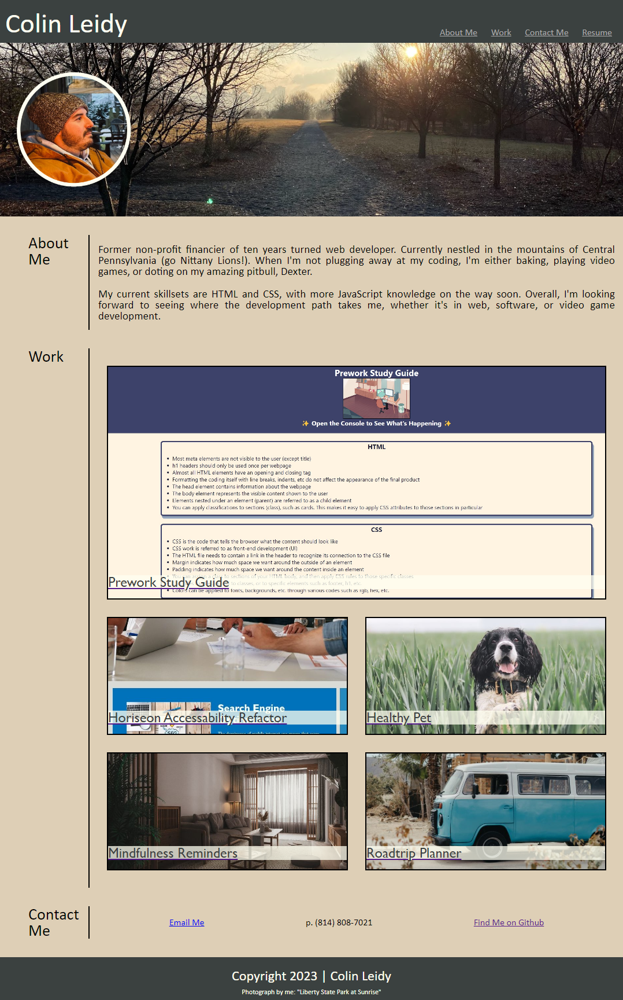

# cleidy-developer-portfolio# 

## Description

I sought to display the projects that I am most proud of in a way that was easy and convienient to prospective employers. This not only makes showing off my development knowledge simple, it also gives me a chance to demonstrate my web development skills via a custom website. Building from scratch allowed me the opportunity to show off my own unique persona, something that is not so easily done via ready-made website templates or blogs.

Building the site was a challenging exercise in some advance CSS skills. The result is a page that reads smoothly, shows off my own style, and adapts to various screen sizes for optimal viewing.

## Usage

The links provided in the header allow you to jump to any section of my portfolio with one quick click. The picture tiles in the "Work" section are links to different projects I (will eventually have) worked on. 

Three ways to reach out to me (email, phone, and GitHub) are provided in the footer area. 

## License

MIT License

Copyright (c) 2023 Colin Leidy

Permission is hereby granted, free of charge, to any person obtaining a copy
of this software and associated documentation files (the "Software"), to deal
in the Software without restriction, including without limitation the rights
to use, copy, modify, merge, publish, distribute, sublicense, and/or sell
copies of the Software, and to permit persons to whom the Software is
furnished to do so, subject to the following conditions:

The above copyright notice and this permission notice shall be included in all
copies or substantial portions of the Software.

THE SOFTWARE IS PROVIDED "AS IS", WITHOUT WARRANTY OF ANY KIND, EXPRESS OR
IMPLIED, INCLUDING BUT NOT LIMITED TO THE WARRANTIES OF MERCHANTABILITY,
FITNESS FOR A PARTICULAR PURPOSE AND NONINFRINGEMENT. IN NO EVENT SHALL THE
AUTHORS OR COPYRIGHT HOLDERS BE LIABLE FOR ANY CLAIM, DAMAGES OR OTHER
LIABILITY, WHETHER IN AN ACTION OF CONTRACT, TORT OR OTHERWISE, ARISING FROM,
OUT OF OR IN CONNECTION WITH THE SOFTWARE OR THE USE OR OTHER DEALINGS IN THE
SOFTWARE.